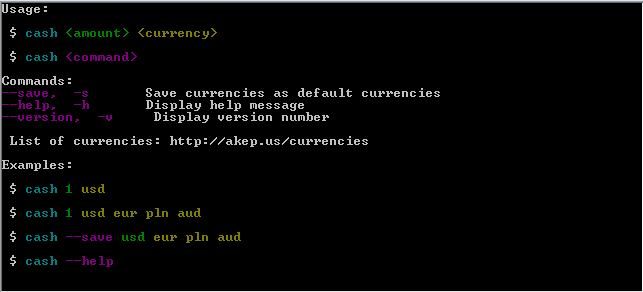
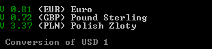

# CASH README

*** Be ready for the Transfert ***
*********************

Explanation 
==
## Convert amont from a currency to another one  ##

## What you need to know #

### Installation ###

- clone or download :

*https://github.com/GMEddy/3-musketeers.git*

- need to have node to use the file js 

- *Command :*
 
 $ npm install index.js

- launch the index.js document  
 $ node index.js

### How to use cash 

When you start cash you can add the amont money before launch the program 

**Exemple :**

#### Test with 1 USD ####

### Autors ###

***GMEddy***

licence  
[https://zenhabits.net/uncopyright/](https://zenhabits.net/uncopyright/)